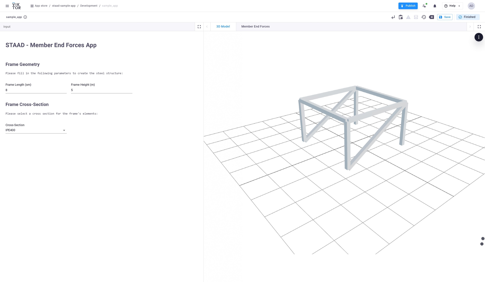

# STAAD Pro Sample App

The following repository demonstrates how to connect a VIKTOR web app with STAAD Pro using the VIKTOR worker. As an example, the demo app creates a steel structure in STAAD Pro, generates a load case with self-weight, calculates the internal loads at the ends of the frame elements, and retrieves the results.

The repository uses the OpenSTAAD Application API, managed by comtypes, to launch, close, and create the model, as well as assign the relevant structural inputs. It also utilizes the Python library [openstaad](https://github.com/OpenStaad/OpenStaadPython) for retrieving the results.




### Requirements

The following are the requirements:

1. **STAAD Pro Executable**: STAAD Pro must be installed on your machine or server.
    - The machine hosting the STAAD Pro executable and valid license requires a Python environment with the following dependencies installed:

    ```bash
    comtypes
    pywin32
    openstaad
    ```

## Worker Configuration

You need to install a VIKTOR-PYTHON worker and execute a [viktor.external.python.PythonAnalysis](https://docs.viktor.ai/sdk/api/external/python/). You can check the documentation to set up the [integration](https://docs.viktor.ai/docs/create-apps/software-integrations/staadpro/).